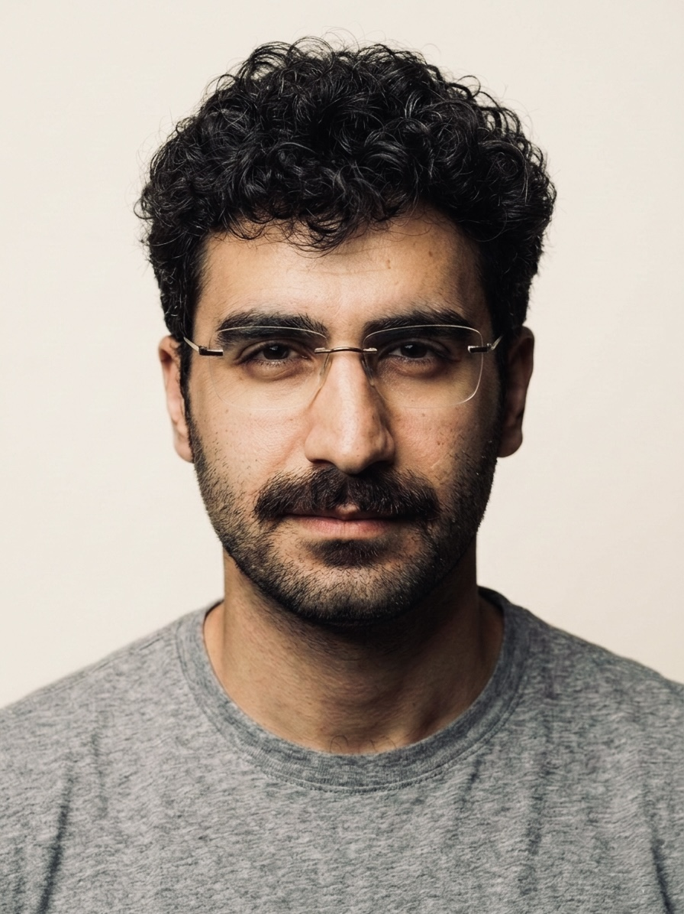

  

  

  Building scalable Python/C++ systems for distributed experimentation, model evaluation, and ML-ready infrastructure.

  
  
  
  

  <a href="#focus-areas">Focus</a> |
  <a href="#experience-highlights">Experience</a> |
  <a href="#featured-projects">Projects</a> |
  <a href="#skills-and-tooling">Skills</a> |
  <a href="#github-analytics">Analytics</a> |
  <a href="#contact">Contact</a>

---

## Focus Areas

  
  
  
  
  
  
  

- Distributed systems and high-performance computing workflows across large CPU/GPU clusters.
- AI/ML infrastructure for training, evaluation, and large-scale experiment orchestration.
- End-to-end Python/C++ platform development for compute-intensive scientific and ML workloads.
- Data ingestion, preprocessing, post-processing, and validation pipelines at scale.

---

## Experience Highlights

- Research Engineer / Applied Scientist, SimCenter and DesignSafe (NSF) (2023-Present): Designed distributed Python/C++ frameworks on TACC systems, built high-throughput execution pipelines, and optimized MPI workloads across thousands of CPU cores.
- Graduate Research Assistant / Founder and Lead Developer, University of Washington (2022-Present): Created and now own Femora, conceived the original architecture, and authored the core framework end-to-end for automated model generation and distributed experimentation.

---

## Featured Projects

| Project | Role | What It Delivers |
|:--|:--|:--|
| [Femora](https://femora.io) | Owner, original creator, and primary author of [GeotechUW/Femora](https://github.com/GeotechUW/Femora) | Automated model generation, scalable preprocessing, and distributed experiment execution. |
| [FemoraX: JAX GPU FEM Solver](https://github.com/amnp95/Femora_solver) | Architect and core developer | Optimized finite element solver in JAX for GPU acceleration, fast kernels, and nonlinear analysis workflows. |
| [SimCenter EE-UQ](https://github.com/NHERI-SimCenter/EE-UQ) | Contributor | Earthquake engineering and uncertainty quantification workflows with scalable simulation tooling. |
| [OpenSees](https://github.com/OpenSees/OpenSees) | Contributor | High-performance structural simulation ecosystem for nonlinear finite element analysis. |

---

## Skills and Tooling

- ML and AI Infrastructure: PyTorch, JAX, Scikit-learn, experiment design, training and evaluation workflows.
- Distributed Systems: MPI, OpenMP, high-throughput orchestration, cluster-scale execution.
- Languages: Python (expert), C++ (advanced), SQL, MATLAB.
- Data and Platform Tooling: NumPy, Pandas, HDF5, VTK/PyVista, Jupyter, Git, CI workflows, Linux, Docker.

  
  
  
  
  
  
  
  
  
  

---

## GitHub Analytics

  
  

---

## Contact

If you are building distributed simulation systems, AI/ML infrastructure, or GPU-first numerical tooling, I would be glad to connect.

  
  
  
  

